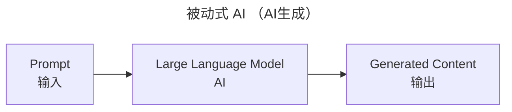
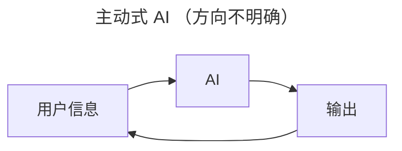

# AI及其相关行业

## 2025-2030 AI发展趋势展望

2024-12-17 [Al Business Trends 2025](https://cloud.google.com/resources/ai-trends-report) 谷歌云发布的这一报告指出，AI发展有如下五个趋势：

1. Multimodal AI: Unleash the power of context
2. AI agents: The evolution from chatbots to multi-agent systems
3. Assistive search: The next frontier for knowledge work
4. AI-powered customer experience: So seamless, it’s almost invisible
5. Security gets tighter—and tougher—with AI

其中，AI agents （人工智能代理）正成为大型科技公司的关注重心。显然，发展 AI 商业应用，需要关注主要问题，即哪种趋势会成为未来5到10年能够落地，并取得商业效益。目前，商业分析师们达成一致：AI agents 是 AI 应用的下一个发展方向。

> **麦肯锡** 2024-07-24 [Why agents are the next frontier of generative AI](https://www.mckinsey.com/capabilities/mckinsey-digital/our-insights/why-agents-are-the-next-frontier-of-generative-ai)
>
> **Gartner** 2024-10-23 [Agentic AI Named Top Tech Trend for 2025](https://campustechnology.com/Articles/2024/10/23/Agentic-AI-Named-Top-Tech-Trend-for-2025.aspx)
>
> **Forrester** 2024-10-03 [The State Of AI Agents, 2024](https://www.forrester.com/report/the-state-of-ai-agents-2024/RES181564)

从各大机构分析结果来看，大家对 AI agents 的期望是能够实现分析和决策的代理人，而不是停留在目前基于数据驱动的生成工具。

### AI agents 可行性

虽然各大公司对 AI agents 抱有极大热情，如 [阿里巴巴](https://www.aol.com/alibaba-going-trying-beat-us-071327906.html) 专注投资 AGI，还有 OpenAI、Google、Meta、Microsoft 等公司2024年财报关于对2026年 AI 的加倍投资。

但苹果率先给大家浇了一盆冷水，2025-03-07 苹果宣布将预计于今年发布的 AI 增强 Siri 功能，推迟到明年，苹果高级总监 Robby Walker 表示推迟的原因是质量问题，公司发现该技术只能在 2/3 到 80% 的时间内正常工作。从中，我们可以推测出，被动式 AI 与主动式 AI 所需的研发难度差距巨大，且目前主动式 AI 发展仍有较多阻碍。 Amazon 上个月宣布但未发布的升级的 Alexa，Google 的 Gemini 助手，都存在错误回答和任务自动化方面的问题。

> **CNBC** 2025-03-07  [Apple delays Siri AI improvements to 2026](https://www.cnbc.com/2025/03/07/apple-delays-siri-ai-improvements-to-2026.html)
>
> **CNBC** 2025-01-16 [Apple disables AI notifications for news in its beta iPhone software](https://www.cnbc.com/2025/01/16/apple-disables-ai-notifications-for-news-in-its-beta-iphone-software.html)

另外，AI 的输入准确性是其发展的一个重要因素。巴菲特有一句名言“It is better to be approximately right than precisely wrong”，但是，这句话是有适用条件的（仅适用软科学）。正如人类学科存在硬科学与软科学的划分，人类不同学科所需的确定性是不一致的，有些软学科学科（经济学、心理学、社会学等）有大致的正确性即可，而硬学科（如数学、物理学、化学学、生物学、计算机科学等）在明确的输入后需要有精确的输出。

从第一性原理思考大模型的本质。大模型的核心是数据、算法、算力。其本质是基于统计学习模式，通过海量数据优化参数空间，其最终结果就是得出一个拟合函数。

那么，大模型解决问题的方法就是在拟合函数中计算回答内容的概率，**就可能得出精确的错误，而非模糊的正确**（过拟合，局部最优解）。

最后，现在以及未来一两年，有没有可能大模型没法提高生产率，从而导致押注AI的企业，如英伟达、微软、OpenAI，都面临没法实现 AGI 及其商业应用，从而导致 AI 泡沫破灭后的真正繁荣。

### 短期和长期 AI 投资分析

正如 Taleb 在《黑天鹅》中写到”在现在的世界里，重要的东西往往乏味而无情“。股市投资不应该掺杂个人的情感，而应该对企业进行深入分析，并分析代表整体市场的市场先生的心理状态。

虚拟经济与实体经济联系紧密才是证券市场成熟的表现，目前美股长牛且经济危机表现越来越短并不是正常的表现，由于实体经济的衰退并没有办法缩短，虚拟经济的持续繁荣必然导致泡沫经济的产生及其破裂。

之前自以为能够看懂 AI ，但是越分析越看不明白其经济效益的前景，也就是所谓 AGI 到底什么时候到来。

个人短期会转向实体经济领域，长期看好台积电，短期看好英伟达。

石油由于世界经济发展局势不明朗，中国世界贸易提高引起的世界经济失衡，俄乌冲突的模糊未来（欧盟求和态度不明确），暂不确定长期走势。因此，不看好油价上涨就不能入手大量的石油公司股票。防止短期套在手里。

### 引用

[2025 年值得关注的 10 个人工智能趋势](https://botpress.com/zh/blog/top-artificial-intelligence-trends#9)

[AI 代理的未来：利润丰厚，但令人惊讶地无聊](https://www.ft.com/content/36785ec8-6f9f-455f-ac74-645bcaa9e221)

**prompt**
我希望你对“AI发展历史"这个问题进行递归分析，目标是找出问题中与AI发展相关的历史和技术

## AI发展历史
质能守恒定律
工程化
经济发展
识别
浙江宇视核心能力就是AI+视频。
商业应用
**what**：它是什么，它的父类、子类、兄弟姐妹是什么。
美国在基础人工智能技术，大模型、人工智能芯片等方面明显领先，中国在人工智能的具体行业应用方面具有优势。
中国在人工智能算力的芯片领域，还稍微落后。
AI所需的各种资源:

1. 计算能力
2. 存储能力
3. 网络带宽
4. 编程人员
5. 其他

Deepseek的三个重要的特色技术(软件方面):

1. 不依赖于对数据进行人工打标签。
2. 混合专家架构，MoE。
3. 多头潜在注意力，MLA。

2024-08，DeepSeek的部分投资人和一些领域专业人士，邀请汪涛和华为负责战略的一位专家进行非正式讨论"大模型是否可以找到某种商业模式赚钱”，华为的专家一直持否定的态度，认为很难有什么成功的商业模击。没有商业效益，不如开源获得社会效益。

**Why**：它能解决什么问题，为什么发展它，古对我有什么好处，

AI能够在哪些领域提高生产率，推动经济增长。

**How**：

**When**：
技术发展是阶梯型的，而不是指数或对数增长。

美国领先的大模型，已经完成了新台阶的跨越，中国也已经完成了。后续大模型的进步，就是在新台阶上的缓慢发展。

不像互联网“忽如一夜春风来，干树万树梨花开"在中国各个商业领域的快速漆透，目前AI并没有给各行各业，特别是中小企业和家庭，带来生产率的变化。互联网与硬件设备、软件存储的发展，带来信息的高速传输和便持存传，创造了大量新的基于网络的商业模式，如网购、看病、打车等。这种影响本顶上影有了物品与服务市场，加快了生产者和消费者之间的交易速度，从而推动生产者对生产率提高的转求，从而推动了各类物品的生产率提高。

但是，AI目前的安防监挖、广告、聊天、按索，并没有本质上促进消费者对物品与服务的器求，仅单方面供给，不同步提高需求，是不可能真正促进经济发展的。

2025-02-07 WSJ报道的"科技巨头（Amazon、Google、Microsoft and Meta）那么，加倍投入AI支出”的目的是什么，感说和5G类似，巨头们加大基础设器投资，稳定行业领先地位。AI并未扩大市场，实现普惠式金融发展。中小企业和家庭，是技术的接受者，而不能像大企业一样利用AI技术扩大销售从而促进生产。

Deepseek Rl实现的与OpenAI o1深度推理能力类似的作用有什么用?

实现方法:

1. 通过规则驱动的方法实现大规模强化学习。
2. 通过深度推理SFT数据与通用SFI数据的混合，实现在不同领域的推理能力。

**transformer 模型**

transformer模型是一种神经网络架构，也就是**大模型架构**，可以自动将一种类型的输入转换为另一种类型的输入。

**OpenAI发布时间**：

2022-11-30，OpenAl发布ChatGPT，生成式人工智能聊天机器人，让人感受到大模型的能力，

2023，Meta发布Llama，开源复现chatGPT。

2024-05，OpenAI发布GPT-4o，o代表omni，是一种多语言、多模态生成式预训练转换器。它可以处理和生成文本、图像和音频。

2024-09-12，OpenAI发布o1预览版，完整版于2024-12-05发布，实现强推理能力，o1在回答问题之前会进行“思考”。

2025-01-20，幻方发布DeepSeek R1，复现OpenAI o1推理模型。DeepSeek R1的意义在于，在有限的算力资源下，通过编程上的算法优化，做出推理模型的领先成果。

**Where**：它能用在哪

包含多种输入（多模态，文本、图像、音频、视频信息）

AI+视频、AI+图像、AI+音频、AI+文本。

应用行业：

1. 制造业。如自动化检测、装配优化和生产线管理。如杭州宇树科技的工业轮足机器狗可自主实现电力巡检、消防检査等
2. 金融。量化交易，技术分析
3. 医疗。药物研发，疾病诊断。
4. 自动驾驶。
5. 广告。
6. 聊天机器人。
7. 教育。
8. 供应链。需求预测，调度优化

**Who**：哪些企业在推动它发展

## 其他领域引起的经济增长
Prompt

1. 从经济学角度分析，互联网带来经济增长的原因，
   互联网扩大市场，推动金融发展，从而提高生产效率，降低成本，促进创新，称为经济增长的重要引擎。

2. 经济学角度分析，5G带来经济增长的原因。

   5G相关技术带动基础设施投资和通信产业发展，赋能其他行业，实现经济结构优化和长期增长。

## 引用

1. 2025-02-07, WSJ, Tech Giants Double Down on Their Massive AI Spending.
2. 2024-12-24, Google Cloud, Al Business Trends 2025.