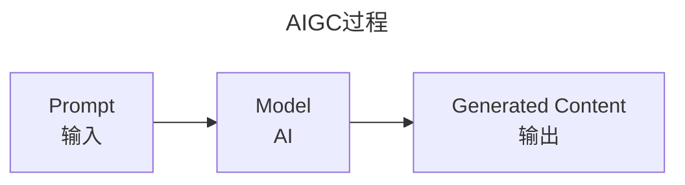
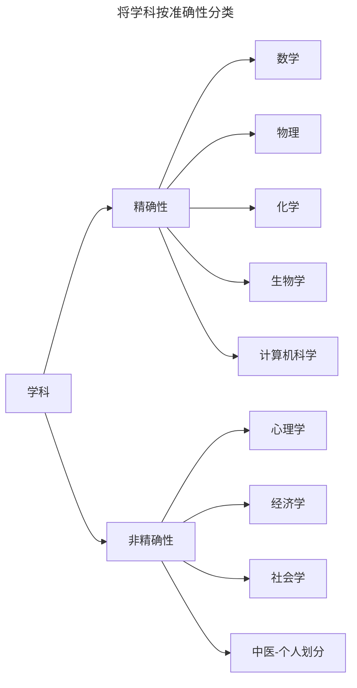

# Prompt Engineering

## 原因

**使用AI为什么要学习Prompt Engineering**

1. 质量守恒定律。模糊的**输入（Prompt）**只能得到一般的**输出**，越准确的输出需要越详细的输入。
2. 工程化。和软件工程研究如何用工程化的方法构建计算机语言类似，使用AI也不是研究世界一般规律的科学，而是一门研究用Prompt构建输入以得到良好的输出。这种工程化方法讲究可量化、可复用、严格约束，从而以较低的成本获得满足需求的输出。

3. 准确性。巴菲特有一句名言“It is better to be approximately right than precisely wrong”，但是，这句话是有适用条件的（仅适用软科学）。正如人类学科存在硬科学与软科学的划分，人类不同学科所需的确定性是不一致的，有些学科有大致的正确性即可，而有些学科在明确的输入后需要有精确的输出。因此，当我们让AI Act as role时，软科学相关的输入即使结果较为模糊也在接受范围，但计算机科学等工程化应用方面的输入期望得到准确的结果，这也导致其在现实世界的应用更为复杂。

| 特征                   | 硬科学                       | 软科学                         |
| ---------------------- | ---------------------------- | ------------------------------ |
| 方法                   | 定量、实验、客观             | 定性、定量、解释               |
| **输入**（数据）       | 经验、可衡量、可控           | 定性和定量                     |
| **输出**（结果准确性） | 高（例如，物理定律）         | 较低（例如，人类行为各不相同） |
| 重复性                 | 高（可在受控条件下重复）     | 较低（上下文和主观性的影响）   |
| 关注点                 | 自然世界（物理、生物）       | 人类社会、文化、行为           |
| 例子                   | 物理学、化学、生物学、天文学 | 心理学、社会学、经济学、人类学 |

## Prompt工具

## Prompt Engineering

## AI与软件开发

考虑软件开发工程师（Software Development Engineer , SDE）的角色，其在输入输出过程中起到了什么作用，再思考AI取代软件开发工程师的可行性。

SDE 在软件开发生命周期的各个阶段工作，从设计和编码到测试和部署。

1. 需求分析。确定人机交互流程，使用的技术。对自然语言（NL）进行分析，逻辑化处理。

2. 开发。使用编程语言实现高质量、高效的代码，遵循编码标准、最佳实践和开发规范。**将自然语言转换为编程语言**，由于自然语言的表现形式多样，如文本、图像、口述，且可能存在漏洞或不准确性，实际上大部分开发人员是在一边进行自然语言转换，一边重新生成逻辑化需求流程。

   因此，开发的代码实际上可能远远偏离了之前处理过后的自然语言，且没有留下可供参考具有较高准确性的更改记录。

   但是，由于开发人员经过严格的培训和大量的实践，能够和信息提供方进行确认和沟通，从而将大部分问题在开发之前就提前规避掉。对于AI而言，这种处理方法存在伦理上的问题，因此，在具有错误性自然语言输入后再来解决问题导致的成本会更加昂贵。

3. 测试。单元测试、集成测试、端到端测试。
4. 部署。
5. 协作和沟通。与跨职能团队合作、代码审查、记录文档。
6. 维护。错误修复和补丁、性能优化、代码重构。

以上分析得出两个重点：

1. 自然语言多种表现形式的输入。目前对AI而言，文本是最易于处理的，图形和口述存在**不确定性**。
2. 沟通问题。基于伦理问题的考虑，AI暂时应该不太可能主动参与软件开发各个流程的主动沟通。

以上两点中，第一点能够通过技术发展逐步解决，第二点是一个长期问题。

因此，个人认为短期内（5-10年），AI不至于大规模取代软件开发工程师，但是软件工程师能够利用AI提高个人开发能力，即将AI作为提高生产率的工具。

最后，将最初的问题提给ChatGPT-4o，得到的答案是，虽然 AI 可以**增强**和**协助**软件工程师，但由于以下几个原因，在不久的将来**完全替换**是不可行的：

1. 创造力与设计
2. 人类协作
3. 道德和问责问题
4. 透明性
5. 复杂和模棱两可的问题解决

## 举例

**Act as a Historian**

I want you to act as a historian. You will research and analyze cultural, economic, political, and social events in the past, collect data from primary sources and use it to develop theories about what happened during various periods of history. My first suggestion request is "The history of economic development." Please explain the history of economics after the Industrial Revolution with relevant people and articles.

