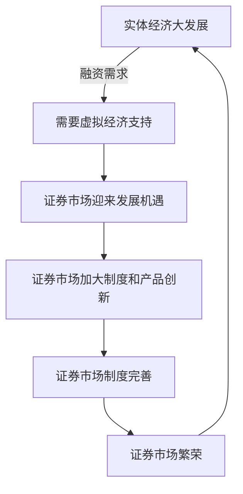

周金涛主要研究经济周期理论。

## 人生就是一场康波

经济周期理论的开创者有两个，一是**康德拉季耶夫**，他提出的周期被称为“康波周期”。

周金涛有一个比较绝对的观点，认为财富积累来源于经济周期运动，即人们抓住经济周期中上升的大类商品，就可以获得足够的财富，也就是将所有的鸡蛋放在一个篮子里，然后等着市场上涨。

> 2025-03-12
>
> 这个观点我觉得是不太合理的，仅研究大周期变化，而不是投资好的企业。同时，他虽然说是研究大周期，但是又搞短期预测，在把握特别大的时候发表出来，把握不大就自己捂着。
>
> 如同 `taleb` 所说的**沉默的证据**，他的理念虽然和巴菲特都是把鸡蛋放在一个篮子里，但是他赌的是大的市场，而且不用自己出钱，而且是预测对了拿出来说，谁知道预测没对的证据藏在哪。
>
> 我觉得最大的问题是，他不是自己投资，而是类似投资经理，拿投资人的钱验证自己的理论，与巴菲特、段永平相比从实践上来说是不一样的。

消灭中产阶级财富的两个方法：一、买进一线城市核心区域的房地产；二、投入新兴产业。

周金涛对巴菲特的评论应该是失误了，将巴菲特的成功归因于康波周期，而到目前为止，巴菲特投资生涯已经跨越一个康波周期（60年），他和格雷厄姆的成功是跨越康波周期的。

周金涛完全相信宿命论，从后视镜看历史。我想较大的原因是他是投资家而不是企业家。

康德拉季耶夫周期一个循环是60年，分为上升、繁荣、衰退、萧条。60年波动中套着三个房地产周期，20年波动一次。一个房地产周期套着两个固定资产投资周期，10年波动一次。一个固定资产投资周期套着三个库存周期。

**世界分为三类经济体**

一是主导国经济体，比如美国。

二是追赶国经济体，比如中国。

三是资源国，比如俄罗斯、澳大利亚、巴西等。

**经济影响了世界政治的走向**

比如2015年大宗商品价格大幅下跌，使资源国陷入衰退。

俄罗斯打仗不仅是收到欧美军事威胁，更重要的还是大宗商品价格及经济被制裁。

**库存周期**

来源于投机。当制造业状态变差，价格一直下跌，导致库存水平下跌。作为制造业中的中间商，就会有价格触底买入的冲动，下跌就尝试买一点。所以可以看到美股指数下跌后总有人在盘前拉一点，连续跌但总有人尝试买一点，就是投机行为的表现。

一个库存循环表现为，从买进东西到厂家生产是六个月，重复两到三次是一年半，再有一个下跌期，所以一个循环是三年的库存周期。

人类社会任何反转点的基本原因是人的投机行为。

> 库存周期如何计算？周金涛在2015年怎么用库存周期理论推断中国库存周期的低点在2016年一季度出现，展开第三库存周期反弹。预测成功价格（什么的价格？）触底反弹。

### 预测的解释

想了下，周金涛的2016-2019预测，除了对宏观经济周期的认识外，还应该包括证券机构的自我验证行为，使市场符合预测结果。

## 繁荣的起点

### 经济失衡

> 原文
>
> 20世纪90年代末以来，伴随着中国经济的崛起，世界经济的失衡现象越来越严重，突出表现为美国的巨额赤字和中国的巨额顺差。这种情景和20世纪70至80年代日本经济腾飞时非常相似，就像当时的美国和日本之间的失衡一样，但程度已远远超过当时。
> 在美国和中国都不愿也不可能休克式调整自己的经济增长方式与经济结构的情况下，这种严重失衡压力只能通过其他方式得以释放。要么美国衰退，从而中国和世界经济衰退；要么美元贬值而人民币继续升值。美国、中国和世界其余各国都不愿意世界经济衰退，从而会共同进行抵抗，那么，从中长期角度看，美元就必然贬值，人民币则必然升值。这种背景下中国应该如何运用自身的货币政策就显得十分微妙。

世界经济史表明，新经济体的崛起，引起世界经济格局和分工体系改变，引起国际经济的失衡。在实体经济难以短期调整的情况下，金融市场成为全球经济失衡压力释放的渠道。

世界经济失衡的根本原因在于失衡双方的 **经济结构** 和 **经济增长方式** ，然而经济增长方式和经济结构具有很大的惯性，不可能在朝夕之间重新调整，在这种情况下，失衡的调整压力往往回转到金融体系，并通过该体系的重新安排得以释放。

当今随着中国经济崛起，世界经济失衡严重，表现为美国巨额贸易赤字和中国的巨额贸易顺差。由于中美都不愿也不可能调整自己的经济增长方式和经济结构，经济失衡压力只能通过其他方式释放。一、要么美国衰退，从而中国和世界经济衰退；二、要么美元贬值而人民币升值。

显然，中美和世界各国都不愿世界经济衰退，从中长期看，美元必然贬值，人民币必然升值。

但是，传统手段（美元贬值、产业回流）出现边际效应递减，2018-2025年美元实际有效汇率贬值12%仅缩减逆差3%。[**美国对华贸易逆差影响因素研究：美国侧的视角**](https://www.hanspub.org/journal/paperinformation?paperid=25907 )

### 全球经济再平衡中的货币政策和宏观前景

工业化大发展，引起虚拟经济（资本市场）大繁荣。

虚拟经济大发展初期可能会延缓实体经济的衰退，但并不是解决问题的根本方法。如果虚拟经济繁荣不断持续，最终导致泡沫经济的破裂。

证券市场的不成熟，造成了实体经济与虚拟经济的断裂，虚拟经济繁荣与实体经济不存在必然联系，完全受政策影响。

当市场成熟以后，证券化率提高以后，资本市场的发展与实体经济的联系愈发紧密。资本在寻找投资机会的同时，带动经济发展，促进虚拟经济繁荣。

**举例：日本在20世纪60年代虚拟经济的繁荣**

1955—1965年，日本第一波经济高增长，是依靠重化工业的设备投资带动的。而支撑这些设备投资的资金来源，主要是通过依靠日本银行贷款的民间金融机构的贷款来筹措的。

但到了1957—1958年以后，其不足的资金部分便通过发行股票来筹措，且这一比重急剧增加。而且，股票的发行对象的范围也有了扩大，1958年之后开始向一般民众公开售股融资。

随着工业化发展，实体经济对虚拟经济，特别是资本市场的需求提高，资本市场的重要性也日益提高。

证券化率 = 总市值 / GDP

