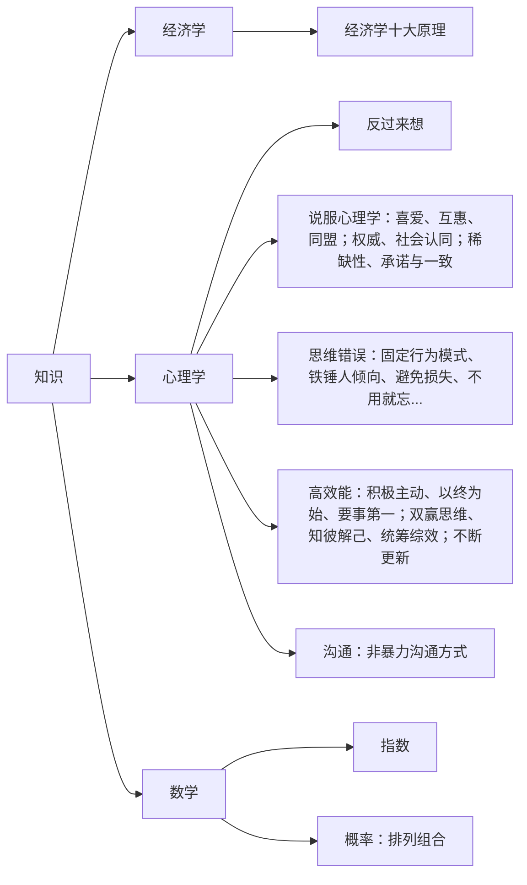

```mermaid
flowchart LR
    knowledge["知识"] --> economics[经济学] --> 经济学十大原理
    knowledge --> phychology[心理学]
    phychology --> thind["反过来想"]
    phychology --> influence["说服心理学：喜爱、互惠、同盟；权威、社会认同；稀缺性、承诺与一致"]
    phychology --> error["思维错误：固定行为模式、铁锤人倾向、避免损失、不用就忘..."]
    phychology --> efficiency["高效能：积极主动、以终为始、要事第一；双赢思维、知彼解己、统筹综效；不断更新"]
    phychology --> communication["沟通：非暴力沟通方式"]
    
    knowledge --> math[数学]
    math --> exponent["指数"]
    math --> probability["概率：排列组合"]
```

