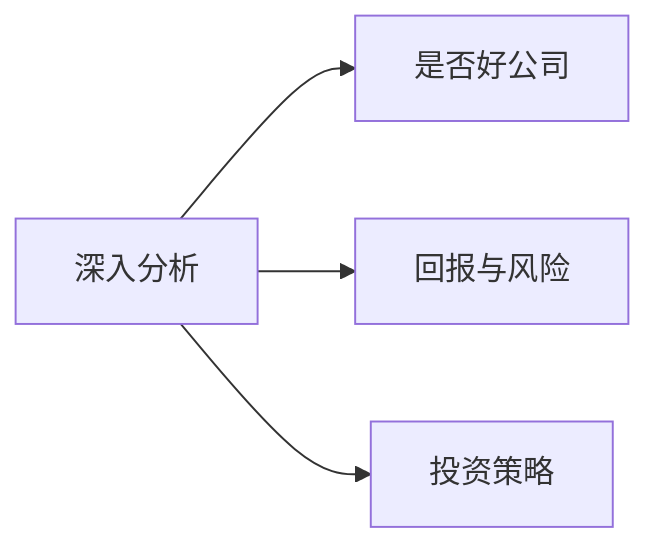

# 投资Checklist

## 判断依据

- 投资：若拟投资金额占您总资金的比例大于 10%，则视为投资。
- 投机：若拟投资金额低于 10%，则可以作为投机操作，但需格外注意风险控制，不要追高。

## 投资操作流程

投资操作是以深入分析为基础，确保本金的安全，并获得适当的回报。

### 深入分析

What：

Why：识别具有长期价值的优质标的，降低投资风险。

1. 发现内在价值。通过财务报表、经营数据、行业地位等信息，发现公司的内在价值。
2. 识别成长潜力与风险。分析公司的盈利模式、现金流、负债水平以及管理层能力，判断其未来成长性和潜在风险，从而避免短视和追高操作。
3. 制定合理的投资策略。根据基本面和技术面分析结果，得出建仓时间和仓位管理策略。

How：首先学习格雷厄姆、巴菲特、段永平等人是怎么做的，然后根据自己的情况进行模仿，逐渐形成自己的策略。

#### 选择好公司的十步法

1. 看大股东及持股比例
2. 看ROE：检查是否具备长期的超额收益能力
3. 看资产负债率：分析高 ROE 是否依赖高杠杆，关注财务健康
4. 看利润表：关注收入增长、毛利率、各项费用（销售、管理、研发等）构成以及净利润率。
5. 看现金流量表：确保经营性现金流入稳定，反映公司真实盈利能力。
6. 看资产负债表：应收账款占收入比重？有息负债比重？...
7. 行业上下游：分析公司在供应链中的位置及其议价能力。
8. 行业：判断所在行业市场结构（如完全竞争、垄断、寡头）及未来发展趋势。
9. 风险因素：导致这家公司经营失败的可能情况？
10. 管理团队：道德与制度？历史劣迹？

#### 护城河 MOAT

- 除了关注大股东和财务指标，还要评估公司是否拥有难以复制的核心竞争优势，如专利、品牌影响力、技术壁垒以及独特的供应链管理。
- 考察公司的市场定价能力，看看它是否能在竞争中保持高毛利和稳定的盈利水平。

### 确保本金安全

在确认公司基本面优秀后，务必等待股价回调至安全价位后再介入，避免高位买入。

### 获得适当回报

当价格波动超出该行业正常范围时，可考虑适时部分减仓获利；若波动在合理范围内则宜长期持有。

### 建仓方法

1. 预先规划。事先确定建仓周期和投资金额，分成10批建仓。
2. 操作原则。下跌时分批建仓，降低平均成本。涨时不建仓。
3. 时机选择。通常建议在每根K线的尾部（即收盘前或K线结束时）观察市场走势，判断是否有合适的建仓时机。

技术分析：

1. 均线 MA
2. 布林带 BOLL

### 定期复盘

定期回顾投资与交易决策，检查是否符合预定策略，及时调整操作思路。

## 投机操作流程

1. 操作原则
   - 投机虽资金规模较小，但仍须遵循“跌时建仓、涨时观望”的原则，切忌追高。
   - 严格设置止损、止盈点，控制风险，避免情绪化操作。

2. 技术分析辅助

   使用K线图、成交量、MACD、RSI等指标辅助判断入场和出场时机，提升操作准确度。

