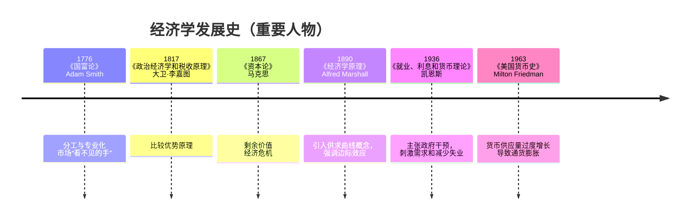

## 经济学发展史

1. **工业革命和古典经济学（18 世纪末至 19 世纪初）**

   18 世纪末开始于英国的工业革命彻底改变了经济体系。重点从以农业为基础的农业经济转移到围绕制造业、机械化和城市中心发展建立的工业经济。

   亚当·斯密 （1723–1790）

2. **社会主义和马克思主义经济思想的兴起（19 世纪中叶）**

   工业资本主义带来的巨大社会变革导致了社会主义和马克思主义思想的兴起，这些思想批判了资本主义制度并呼吁替代经济模式。

   Karl Marx (1818–1883)

3. **边际革命和新古典经济学的兴起（19 世纪末）**

   为了应对古典经济学的局限性以及社会主义和马克思主义批判的兴起，19 世纪后期的**边际革命**带来了关于价值、效用和生产的新视角。这种转变导致了**新古典经济学**的发展，并在 20 世纪初占据主导地位。

   阿尔弗雷德·马歇尔 （1842–1924）

4. **凯恩斯主义革命和宏观经济学的兴起（1930 年代）**

   1930 年代的大萧条挑战了古典和新古典经济范式，这些范式无法解释长期的经济衰退和大规模失业。

5. **货币主义、供给侧经济学和新自由主义革命（1970 年代 – 1980 年代）**

   1970 年代带来了新的经济挑战，包括滞胀，这导致从凯恩斯主义转向货币主义和供给侧经济学。这一时期还见证了**新自由主义经济学**的兴起，它支持自由市场资本主义和有限的政府干预。

6. **全球化、金融化和信息经济学的兴起（1990 年代 – 2000 年代）**

   1990 年代和 2000 年代见证了**全球化**的加速和金融的日益主导地位，导致**信息经济学**的兴起和 2008 年全球金融危机等新挑战的出现。

7. **后危机经济学：不平等、气候变化和未来（2010 年代至今）**

   在 2008 年金融危机之后，随着人们对**收入不平等**、**气候变化**和**自动化**等问题的认识不断提高，经济学一直在发展以应对新的挑战

## 《国富论》

《国富论》是18世纪英国经济学家Adam Smith的代表作，首次出版于1776年。这部著作被认为是现代经济学的奠基之作。书中探讨了国民财富的性质和原因，提出了劳动分工、货币、价格、资本积累等概念，以及自由市场机制的作用。

Adam Smith的许多见解仍然是现代经济学的核心内容。

分工与专业化

- 分工的重要性：Adam Smith强调了劳动分工对于提高生产率的重要性。他认为，通过将生产过程分解为多个简单任务，工人可以更加熟练地执行各自的任务，从而大大地提高了工作效率。
- 市场规模与分工：Adam Smith还指出，市场的规模决定了分工的程度。更大的市场允许更细的分工。

自由市场机制

- 价格：自由市场的价格机制是实现资源最优配置的关键。价格反映了物品和服务的相对稀缺性，引导生产者根据市场的需求调节生产和投资决策。
- 看不见的手：描述市场中的自我调节机制。个人追求自身利益的行为，会自然而然地引导资源的有效配置，最终实现经济福利的最大化。其工具是价格制度。

## 《资本论》

是马克思的著作，1867-1894年分为三卷出版。

《资本论》第一卷的主要内容有三个：劳动价值论、剩余价值生产理论和资本积累理论；

《资本论》第二卷研究的是广义的资本流通过程，中心考察剩余价值的实现；

《资本论》第三卷分析了资本主义生产的总过程，中心阐明剩余价值的分配。所以说《资本论》的基础是劳动价值论，核心是剩余价值。